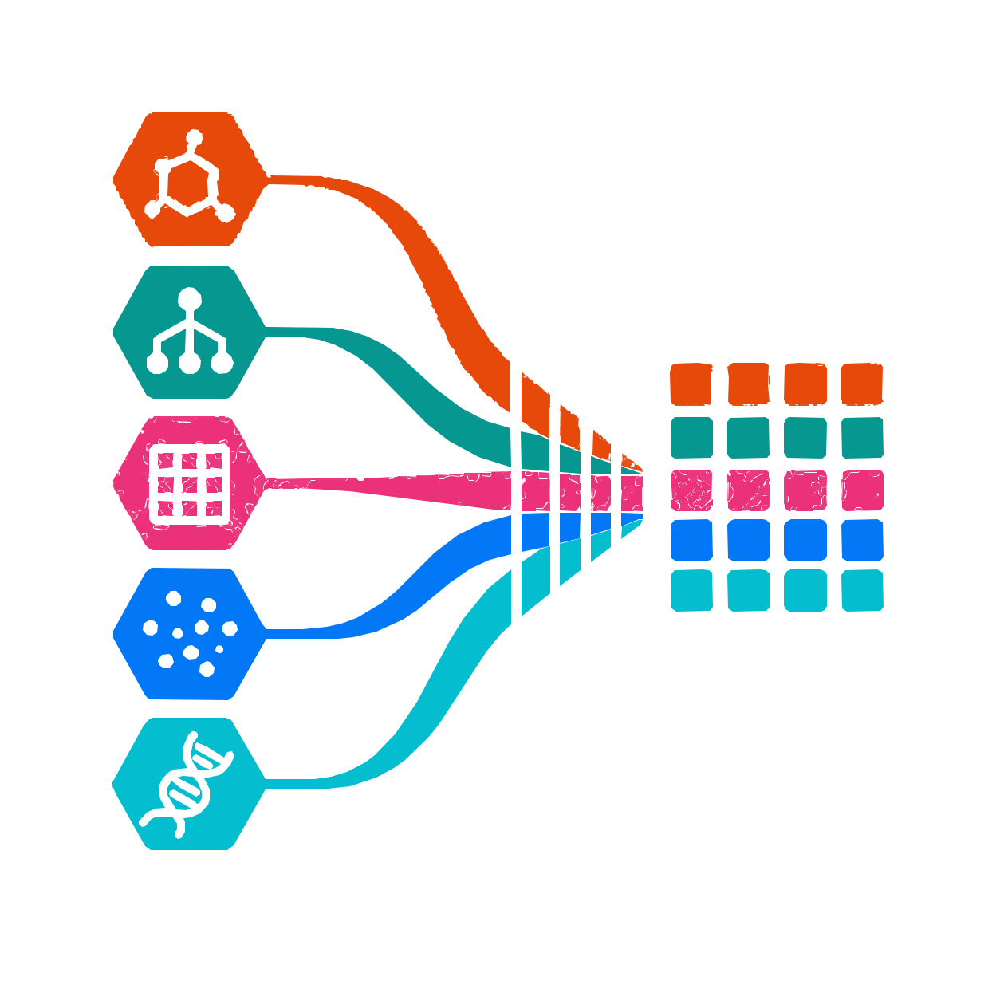

# 🏔️ aspect




**aspect** is a lightweight featurisation layer for tabular machine-learning data.

It lets you define independent feature pipelines for different input columns, then apply them to dictionaries, Pandas data frames, local files, Hugging Face datasets, or saved dataset checkpoints.

The core idea is:

```text
input table
  ├── numeric column  → log / identity / custom transforms
  ├── categorical col → hash / one-hot / custom transforms
  ├── SMILES column   → chemistry features, if installed
  ├── species column  → taxonomic features, if installed
  └── text column     → deep embeddings, if installed

output dataset with named feature columns
```

---

## Contents

* [Quick start](#quick-start)
* [Installation](#installation)
* [Command-line interface](#command-line-interface)
* [Python API](#python-api)
* [Feature specifications](#feature-specifications)
* [Available transforms](#available-transforms)
* [Saving and loading pipelines](#saving-and-loading-pipelines)
* [Supported input and output formats](#supported-input-and-output-formats)
* [Custom transforms](#custom-transforms)
* [Optional chemistry, taxonomy, and deep-learning features](#optional-chemistry-taxonomy-and-deep-learning-features)
* [Development](#development)
* [Issues, problems, suggestions](#issues-problems-suggestions)

---

## Quick start

### Python API

```python
from aspect.data import DataPipeline

data = {
    "compound_id": ["cmpd-1", "cmpd-2", "cmpd-3"],
    "assay": ["MIC", "MIC", "IC50"],
    "mwt": [46.07, 60.10, 78.11],
    "pIC50": [5.0, 6.2, 4.8],
}

pipe = DataPipeline(
    column_transforms={
        "log_mwt": ("mwt", "log"),
        "assay_hash": (
            "assay",
            {"name": "hash", "kwargs": {"ndim": 8}},
        ),
        "target": ("pIC50", "identity"),
    },
    columns_to_keep=["compound_id"],
)

features = pipe(data, drop_unused_columns=True)

print(features.column_names)
print(pipe.data_out_shape)
print(features[:2])
```

Expected column structure:

```text
['compound_id', 'log_mwt', 'assay_hash', 'target']
```

`log_mwt` and `target` are `(n, 1)` arrays. `assay_hash` is an `(n, 8)` array. The output is a Hugging Face `Dataset`, so it can be saved, sliced, converted to Pandas, or passed into a downstream PyTorch/data-loader layer.

---

### Command-line quick start

Create a small CSV:

```bash
cat > compounds.csv <<'CSV'
compound_id,assay,mwt,pIC50
cmpd-1,MIC,46.07,5.0
cmpd-2,MIC,60.10,6.2
cmpd-3,IC50,78.11,4.8
CSV
```

Featurise it:

```bash
aspect featurize compounds.csv \
    --features mwt:log@log_mwt assay:hash@assay_hash pIC50@target \
    --extras compound_id \
    --output features.parquet
```

The feature specification means:

```text
mwt:log@log_mwt       # read mwt, apply log, write column name `log_mwt`
assay:hash@assay_hash # read assay, apply deterministic hash vector, write column name `assay_hash`
pIC50@target          # read pIC50, identity transform, write column name `target`
--extras compound_id  # retain compound_id without transforming it
```

---

### Reuse a saved feature specification

```bash
aspect serialize \
    --features mwt:log@log_mwt assay:hash@assay_hash pIC50@target \
    --extras compound_id \
    --output feature-spec.as
```

Then apply the same specification later:

```bash
aspect featurize compounds.csv \
    --config feature-spec.as \
    --output features-from-config.parquet
```

---

## Installation

### Basic installation

```bash
pip install aspect-data
```

### Chemistry features

Install chemistry support if you want SMILES featurisation via `schemist`:

```bash
pip install "aspect-data[chem]"
```

### Chemprop support

Install Chemprop support if you want to prepare Chemprop-style molecular data:

```bash
pip install "aspect-data[chemprop]"
```

### Taxonomic features

Install taxonomy support if you want species or taxon-ID features via `vectome`:

```bash
pip install "aspect-data[bio]"
```

### Deep-learning features

Install transformer support if you want Hugging Face model embeddings:

```bash
pip install "aspect-data[deep]"
```

### Development installation

```bash
git clone https://github.com/scbirlab/aspect.git
cd aspect
pip install -e ".[dev]"
```

---

## Command-line interface

The CLI has two main commands:

```bash
aspect serialize
aspect featurize
```

Use help for the full option list:

```bash
aspect --help
aspect serialize --help
aspect featurize --help
```

### `aspect serialize`

Create a reusable pipeline checkpoint from a feature specification.

```bash
aspect serialize \
    --features mwt:log@log_mwt assay:hash@assay_hash \
    --extras compound_id pIC50 \
    --output feature-spec.as
```

### `aspect featurize`

Apply a feature specification or saved config to a dataset.

```bash
aspect featurize compounds.csv \
    --features mwt:log@log_mwt assay:hash@assay_hash \
    --extras compound_id pIC50 \
    --output features.parquet
```

or:

```bash
aspect featurize compounds.csv \
    --config feature-spec.as \
    --output features.parquet
```

### Slice a dataset

This is useful for testing on large datasets.

```bash
aspect featurize large-table.csv \
    --start 1000 \
    --end 2000 \
    --features assay:hash@assay_hash mwt:log@log_mwt \
    --output slice.parquet
```

### Cache location

Use `--cache` to control where intermediate Hugging Face dataset files are cached.

```bash
aspect featurize compounds.csv \
    --features assay:hash@assay_hash \
    --cache .aspect-cache \
    --output features.parquet
```

---

## Python API

The main class is `DataPipeline`.

```python
from aspect.data import DataPipeline
```

A `DataPipeline` maps one or more input columns to named output feature columns.

```python
pipe = DataPipeline(
    column_transforms={
        "log_mwt": ("mwt", "log"),
        "assay_hash": ("assay", "hash"),
    },
)
```

Apply it to a dictionary:

```python
out = pipe({
    "mwt": [46.07, 60.10, 78.11],
    "assay": ["MIC", "MIC", "IC50"],
})
```

Apply it to a Pandas data frame:

```python
import pandas as pd
from aspect.data import DataPipeline

df = pd.DataFrame({
    "mwt": [46.07, 60.10, 78.11],
    "assay": ["MIC", "MIC", "IC50"],
})

pipe = DataPipeline({
    "log_mwt": ("mwt", "log"),
    "assay_hash": ("assay", {"name": "hash", "kwargs": {"ndim": 16}}),
})

out = pipe(df)
```

Apply it to a local file:

```python
pipe = DataPipeline({
    "log_mwt": ("mwt", "log"),
})

out = pipe("compounds.csv")
```

Apply it to a Hugging Face dataset reference:

```python
pipe = DataPipeline({
    "assay_hash": ("assay", "hash"),
})

out = pipe("hf://datasets/scbirlab/fang-2023-biogen-adme~scaffold-split:train")
```

---

## Feature specifications

A feature specification defines:

1. the input column;
2. the transform or chain of transforms;
3. the output column name.

### Python feature specs

The recommended Python form is:

```python
{
    "output_column": ("input_column", "transform_name")
}
```

Example:

```python
pipe = DataPipeline({
    "log_mwt": ("mwt", "log"),
})
```

For transform arguments, use a dictionary with a nested `kwargs` field:

```python
pipe = DataPipeline({
    "assay_hash": (
        "assay",
        {"name": "hash", "kwargs": {"ndim": 32, "seed": 123}},
    ),
})
```

For chained transforms, pass a list:

```python
pipe = DataPipeline({
    "log_hashed_assay": (
        "assay",
        [
            {"name": "hash", "kwargs": {"ndim": 16}},
            "log",
        ],
    ),
})
```

Only use transform chains when the output of one transform is mathematically valid input for the next. For example, `hash → log` is usually not sensible because hash values may be negative.

### CLI feature specs

CLI specs use a compact string form:

```text
input_column:transform@output_column
```

Examples:

```text
mwt:log@log_mwt
assay:hash@assay_hash
pIC50@target
```

Supported forms:

| Spec                        | Meaning                                        |
| --------------------------- | ---------------------------------------------- |
| `column`                    | keep `column` as an extra column               |
| `column@new_name`           | identity transform from `column` to `new_name` |
| `column:transform`          | transform `column`; auto-name the output       |
| `column:transform@new_name` | transform `column`; write `new_name`           |
| `column:t1:t2@new_name`     | apply chained transforms                       |

For parameterised transforms, prefer the Python API. The Python API supports structured keyword arguments cleanly through `{"name": ..., "kwargs": ...}`.

---

## Available transforms

### Base transforms

These are available with the standard installation.

| Transform  |       Input |              Output | Notes                                                      |
| ---------- | ----------: | ------------------: | ---------------------------------------------------------- |
| `identity` |  any column |               array | Pass-through transform                                     |
| `log`      |     numeric |               array | Natural logarithm, `np.log`                                |
| `hash`     | string-like | fixed-length vector | Deterministic string hashing                               |
| `one-hot`  | categorical |              vector | Python API recommended because categories must be supplied |

Example:

```python
from aspect.data import DataPipeline

pipe = DataPipeline({
    "log_mwt": ("mwt", "log"),
    "assay_hash": (
        "assay",
        {"name": "hash", "kwargs": {"ndim": 16}},
    ),
    "assay_onehot": (
        "assay",
        {"name": "one-hot", "kwargs": {"categories": ["MIC", "IC50"]}},
    ),
})
```

### Chemistry transforms

Require:

```bash
pip install "aspect-data[chem]"
```

| Transform            |  Input |                   Output |
| -------------------- | -----: | -----------------------: |
| `morgan-fingerprint` | SMILES |    molecular fingerprint |
| `descriptors-2d`     | SMILES | 2D molecular descriptors |
| `descriptors-3d`     | SMILES | 3D molecular descriptors |

Example:

```python
from aspect.data import DataPipeline

data = {
    "compound_id": ["ethanol", "ethylamine", "benzene"],
    "smiles": ["CCO", "CCN", "c1ccccc1"],
}

pipe = DataPipeline(
    {
        "morgan": ("smiles", "morgan-fingerprint"),
        "desc2d": ("smiles", "descriptors-2d"),
    },
    columns_to_keep=["compound_id"],
)

features = pipe(data, drop_unused_columns=True)
```

### Taxonomic transforms

Require:

```bash
pip install "aspect-data[bio]"
```

| Transform             |                    Input |                Output |
| --------------------- | -----------------------: | --------------------: |
| `vectome-fingerprint` | species name or taxon ID | taxonomic fingerprint |

Example:

```python
from aspect.data import DataPipeline

data = {
    "species": [
        "Mycobacterium tuberculosis",
        "Escherichia coli",
        "Staphylococcus aureus",
    ],
}

pipe = DataPipeline({
    "species_fp": (
        "species",
        {"name": "vectome-fingerprint", "kwargs": {"ndim": 128}},
    ),
})

features = pipe(data)
```

### Deep embedding transforms

Require:

```bash
pip install "aspect-data[deep]"
```

| Transform | Input |                                    Output |
| --------- | ----: | ----------------------------------------: |
| `hf-bart` |  text | aggregated BART encoder/decoder embedding |

Example:

```python
from aspect.data import DataPipeline

data = {
    "description": [
        "cell wall inhibitor",
        "protein synthesis inhibitor",
        "DNA gyrase inhibitor",
    ],
}

pipe = DataPipeline({
    "text_embedding": (
        "description",
        {
            "name": "hf-bart",
            "kwargs": {
                "ref": "facebook/bart-base",
                "aggregator": ["mean", "max"],
            },
        },
    ),
})

features = pipe(data)
```

The model will be loaded through Hugging Face `transformers`, so the first run may download model weights.

### Chemprop transform

Require:

```bash
pip install "aspect-data[chemprop]"
```

`chemprop-mol` is intended for converting SMILES into Chemprop-style molecular datapoints, with optional labels and extra dense features.

Because Chemprop models often need special collation and graph batching, use this transform together with a downstream model adapter or data-loader layer rather than assuming the output should be horizontally stacked with ordinary numeric arrays.

---

## Saving and loading pipelines

`DataPipeline` objects can be checkpointed.

```python
from aspect.data import DataPipeline

pipe = DataPipeline({
    "log_mwt": ("mwt", "log"),
    "assay_hash": (
        "assay",
        {"name": "hash", "kwargs": {"ndim": 16}},
    ),
})

pipe.save_checkpoint("feature-spec.as")
```

Load the checkpoint later:

```python
from aspect.data import DataPipeline

pipe = DataPipeline().load_checkpoint("feature-spec.as")

out = pipe({
    "mwt": [46.07, 60.10, 78.11],
    "assay": ["MIC", "MIC", "IC50"],
})
```

If the pipeline has already been applied to data, the checkpoint can also store input/output datasets unless skipped:

```python
pipe.save_checkpoint(
    "feature-spec-and-data.as",
    skip_data_in=False,
    skip_data_out=False,
)
```

For reusable feature specifications, it is usually cleaner to save the pipeline before applying it to a dataset, or to skip data when checkpointing.

---

## Supported input and output formats

### Python inputs

`DataPipeline` accepts:

| Input type                     | Example                                                |
| ------------------------------ | ------------------------------------------------------ |
| dictionary / mapping           | `{"smiles": ["CCO", "CCN"]}`                           |
| Pandas `DataFrame`             | `pipe(df)`                                             |
| Hugging Face `Dataset`         | `pipe(dataset)`                                        |
| Hugging Face `IterableDataset` | `pipe(iterable_dataset)`                               |
| local file path                | `pipe("data.csv")`                                     |
| Hugging Face dataset ref       | `pipe("hf://datasets/org/name~config:split@revision")` |

### Local file inputs

Supported local input extensions include:

* `.csv`, `.csv.gz`
* `.tsv`, `.tsv.gz`
* `.txt`, `.txt.gz`
* `.json`
* `.parquet`
* `.arrow`
* `.xml`
* `.hf` saved Hugging Face datasets

### CLI outputs

`aspect featurize --output` can write:

| Extension                          | Output                                    |
| ---------------------------------- | ----------------------------------------- |
| `.csv`, `.csv.gz`                  | CSV                                       |
| `.tsv`, `.txt`, optionally gzipped | delimited text                            |
| `.json`                            | JSON                                      |
| `.parquet`                         | Parquet                                   |
| `.sql`                             | SQL                                       |
| `.hf`                              | Hugging Face dataset saved to disk        |
| unknown extension                  | Hugging Face dataset, with `.hf` appended |

---

## Working with output columns

By default, `DataPipeline` keeps the original input columns and appends feature columns.

```python
out = pipe(data)
```

To keep only feature outputs and selected metadata:

```python
pipe = DataPipeline(
    {
        "log_mwt": ("mwt", "log"),
        "assay_hash": ("assay", "hash"),
    },
    columns_to_keep=["compound_id"],
)

out = pipe(data, drop_unused_columns=True)
```

You can also provide extra columns at call time:

```python
out = pipe(
    data,
    drop_unused_columns=True,
    keep_extra_columns=["compound_id", "target"],
)
```

After running a pipeline, inspect inferred output shapes:

```python
print(pipe.data_out_shape)
```

Example:

```text
{
    "compound_id": (),
    "log_mwt": (1,),
    "assay_hash": (256,)
}
```

---

## Custom transforms

Custom transforms can be registered using `register_function`.

A registered transform should be a factory: it receives configuration arguments and returns a callable with signature:

```python
fn(data, input_column) -> numpy.ndarray
```

Example:

```python
import numpy as np

from aspect.data import DataPipeline
from aspect.transform.registry import register_function


@register_function("square")
def Square():
    def _square(data, input_column):
        x = np.asarray(data[input_column], dtype=float)
        return x ** 2

    return _square


pipe = DataPipeline({
    "mwt_squared": ("mwt", "square"),
})

out = pipe({
    "mwt": [46.07, 60.10, 78.11],
})
```

With arguments:

```python
@register_function("scale")
def Scale(factor=1.0):
    def _scale(data, input_column):
        x = np.asarray(data[input_column], dtype=float)
        return x * factor

    return _scale


pipe = DataPipeline({
    "scaled_mwt": (
        "mwt",
        {"name": "scale", "kwargs": {"factor": 0.001}},
    ),
})
```

If you save a pipeline using a custom transform, make sure the module that registers the transform is imported before loading the checkpoint.

---

## Optional chemistry, taxonomy, and deep-learning examples

### Mixed ADME-style table

```python
from aspect.data import DataPipeline

data = {
    "compound_id": ["cmpd-1", "cmpd-2", "cmpd-3"],
    "smiles": ["CCO", "CCN", "c1ccccc1"],
    "assay": ["solubility", "clearance", "microsome"],
    "species": ["M. tuberculosis", "E. coli", "S. aureus"],
    "mwt": [46.07, 45.08, 78.11],
    "label": [0.1, 0.4, 0.8],
}

pipe = DataPipeline(
    {
        "morgan": ("smiles", "morgan-fingerprint"),
        "desc2d": ("smiles", "descriptors-2d"),
        "assay_hash": (
            "assay",
            {"name": "hash", "kwargs": {"ndim": 32}},
        ),
        "species_fp": (
            "species",
            {"name": "vectome-fingerprint", "kwargs": {"ndim": 64}},
        ),
        "log_mwt": ("mwt", "log"),
        "y": ("label", "identity"),
    },
    columns_to_keep=["compound_id"],
)

features = pipe(data, drop_unused_columns=True)
```

This produces separate feature columns for chemical structure, descriptors, assay identity, species identity, molecular weight, and target label.

A downstream model adapter can decide whether to:

* concatenate dense arrays;
* route different columns into different neural-network towers;
* collate graph-like objects separately;
* keep labels and metadata separate from model inputs.

---

## Development

Install development dependencies:

```bash
pip install -e ".[dev]"
```

Run tests:

```bash
pytest
```

Run the CLI smoke test script:

```bash
bash test/scripts/run-tests.sh
```

Run selected doctests:

```bash
python -m doctest aspect/data.py
python -m doctest aspect/transform/base.py
python -m doctest aspect/transform/functions.py
```

## Issues, problems, suggestions

Please open an issue on GitHub:

[https://github.com/scbirlab/aspect/issues](https://github.com/scbirlab/aspect/issues)


## Documentation

(To come at [ReadTheDocs](https://aspect.readthedocs.org).)
